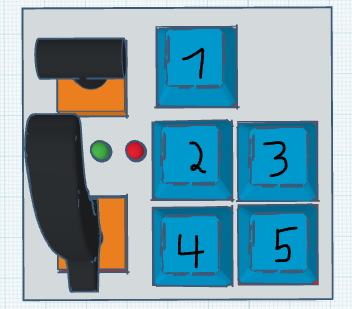

BOM

The materials required are:
2 joysticks (drone controller or playstation type)
2 220 ohm resistors
5 MX-style switches
2 4 mm LEDs (can be any color but I used red and green)
seeeduino rp 2040
3D-printed case and
custom pcb 

Assembly

PCB assembly is pretty straightforward if there is a white line between 2 holes; you need to connect them on the back, and then you just put it in the case and put the top one on (it should stay on without screws), and I will also make a tutorial when I get the PCB.

Setting up

Setting up is pretty simple; you just flash the main.py to your Xiao RP2040, and then you are going to have to launch Geofs and use the trim button to get the cursor in the middle (first time only, this saves).
Then you are going to want to bind keys to actions. What I did was 1, trim, but you can’t change the keybind for this one without messing with the code; 2 is landing gear toggle automatically but you can change buttons 2 to 5 in keybinds; 3, flaps toggle; 4, airbrake; and 5, wheel brake (has to stay wheelbrake because this one isn’t a toggle)

Using the hackpad

Just launch Geofs and plug it in and enjoy :)

